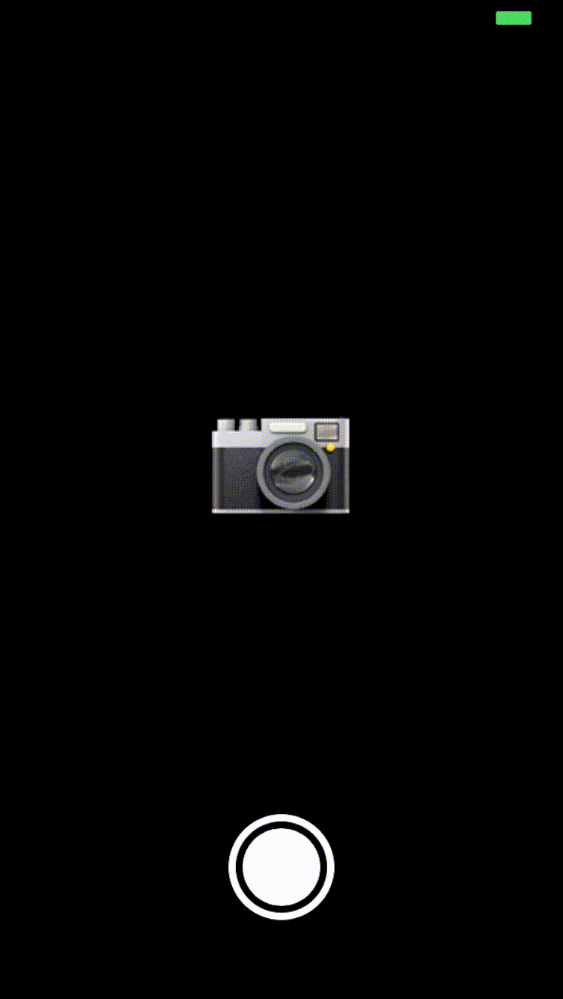
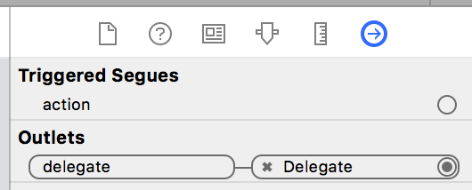
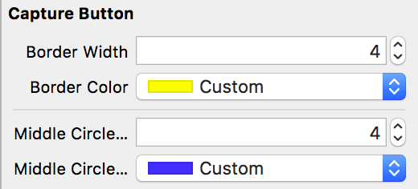
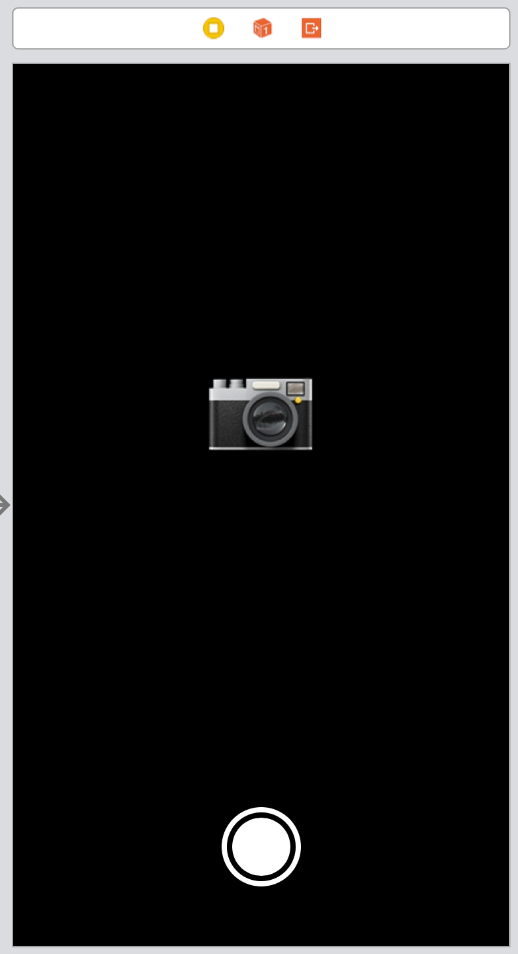

# DJCaptureButton
Camera styled capture button with 3D touch.



## Example

To run the example project, clone the repo, and run `pod install` from the Example directory first.

## Requirements

iOS 10.0

## Installation

DJCaptureButton is available through [CocoaPods](https://cocoapods.org). To install
it, simply add the following line to your Podfile:

```ruby
pod 'DJCaptureButton'
```

## Usage

### Manual

```swift
let captureButton = DJCaptureButton(frame: .init(x: 0, y: 0, width: 60, height: 60))
captureButton.delegate = self

view.addSubview(captureButton)
```

##### Add delegate

```swift
extension ViewController: DJCaptureButtonDelegate {

    func captureButtonDidFire(captureButton: DJCaptureButton) {
        debugPrint("Capture button action")
    }
}

```

#### Customize

```swift
captureButton.borderWidth = 4
captureButton.borderColor = .yellow

captureButton.middleCircleOffset = 4
captureButton.middleCircleColor = .blue
```

### Interface Builder

1. Add a UIButton in Interface Builder.
2. Set the "class" property to DJCaptureButton.
4. Connect the delegate.



See the *Example* Project.

#### Customize
Additional properties are available in the Attribute inspector:



## Result



## Author

David Jonsén

## License

DJCaptureButton is available under the MIT license. See the LICENSE file for more info.
